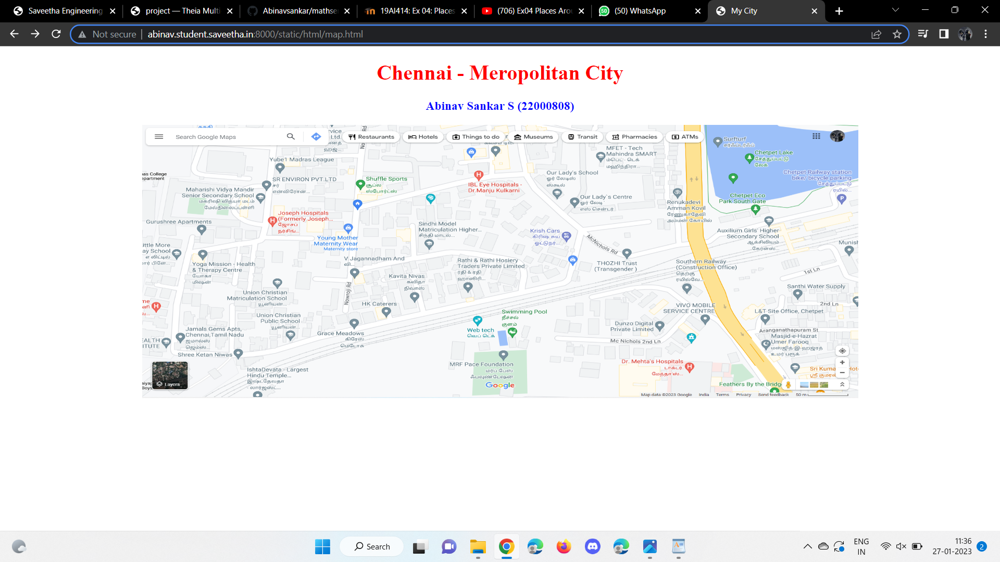
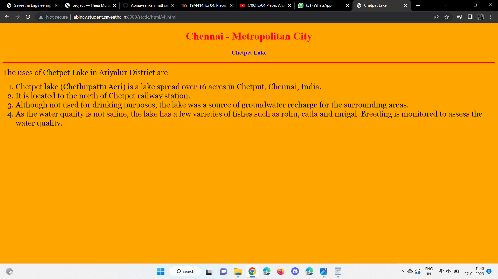
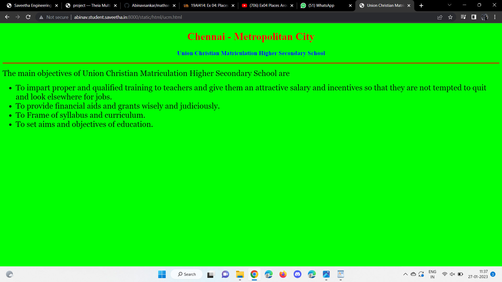
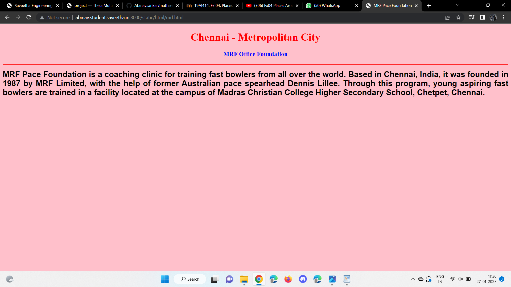
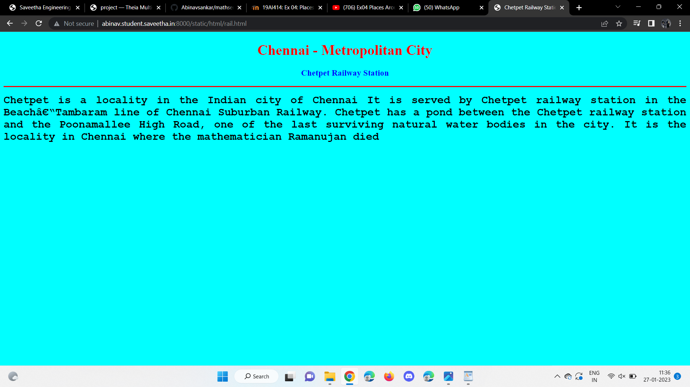
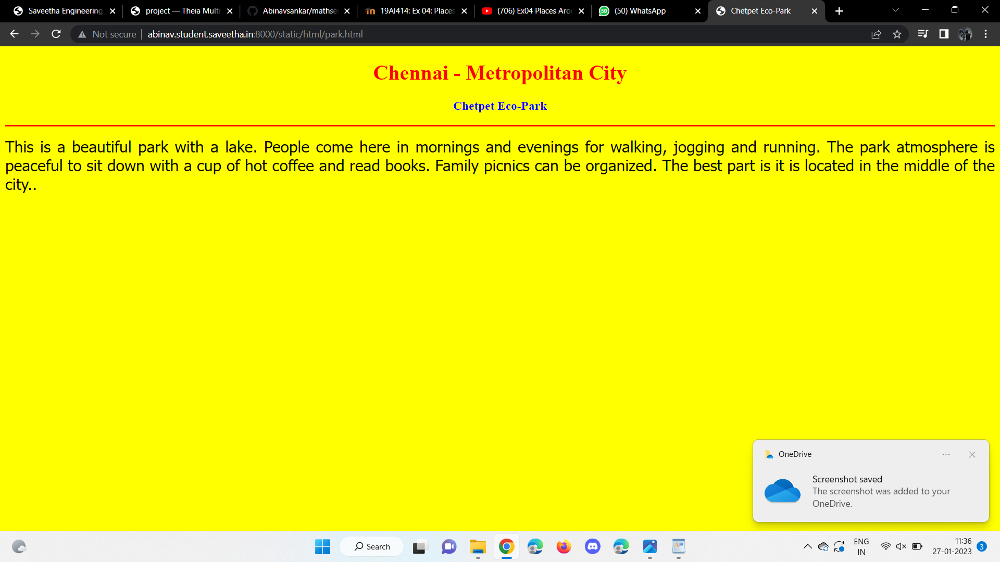
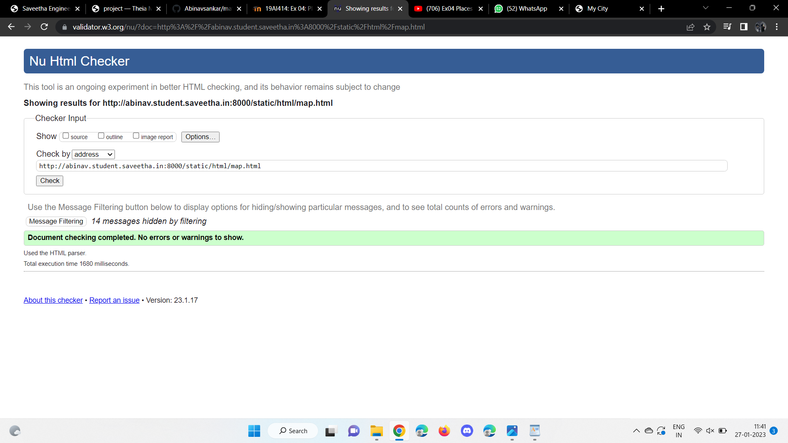

# Places Around Me
## AIM:
To develop a website to display details about the places around my house.

## Design Steps:

### Step 1:
Clone the github repository into Theia IDE.

### Step 2:
Create a new Django project

### Step 3:
Write the needed HTML

### Step 4:
Run the Django server and execute the HTML files

## Code:
```
map.html

<!DOCTYPE html>
<html lang="en">
<head>
<title>My City</title>
</head>
<body>
<h1 align="center">
<font color="red"><b>Chennai - Meropolitan City</b></font>
</h1>
<h3 align="center">
<font color="blue"><b>Abinav Sankar S (22000808)</b></font>
</h3>
<center>

<map name="MyCity">
<area shape="circle" coords="190,50,20" href="/static/html/ucm.html" title="Union Christian Maticulation School">
<area shape="rectangle" coords="230,30,260,60" href="/static/html/mrf.html" title="MRF Pace Foundation">
<area shape="circle" coords="400,350,50" href="/static/html/vk.html" title="Chetpet Lake">
<area shape="circle" coords="400,200,75" href="/static/html/rail.html" title="Chetpet Railway Station">
<area shape="rectangle" coords="490,150,870,320" href="/static/html/park.html" title="Chetpet Eco-Park">
</map>
</center>
</body>
</html> 

ucm.html

<!DOCTYPE html>
<html lang="en">
<head>
<title>Union Christian Matriculation High. Sec. School</title>
</head>
<body bgcolor="lime">
<h1 align="center">
<font color="red"><b>Chennai - Metropolitan City</b></font>
</h1>
<h3 align="center">
<font color="blue"><b>Union Christian Matriculation Higher Secondary School</b></font>
</h3>
<hr size="3" color="red">
<p align="justify">
<font face="Georgia" size="5">
The main objectives of Union Christian Matriculation Higher Secondary School are 
<ul>
<li>To impart proper and qualified training to teachers and give them an attractive salary and incentives so that they are not tempted to quit and look elsewhere for jobs.</li>
<li>To provide financial aids and grants wisely and judiciously.</li>
<li>To Frame of syllabus and curriculum.</li>
<li>To set aims and objectives of education.</li>
</ul>
</font>
</p>
</body>
</html>

mrf.html

<!DOCTYPE html>
<html lang="en">
<head>
<title>MRF Pace Foundation</title>
</head>
<body bgcolor="pink">
<h1 align="center">
<font color="red"><b>Chennai - Metropolitan City</b></font>
</h1>
<h3 align="center">
<font color="blue"><b>MRF Office Foundation</b></font>
</h3>
<hr size="3" color="red">
<p align="justify">
<font face="Arial" size="5">
<b>
MRF Pace Foundation is a coaching clinic for training fast bowlers from all over the world.
Based in Chennai, India, it was founded in 1987 by MRF Limited, with the help of former Australian pace spearhead Dennis Lillee.
Through this program, young aspiring fast bowlers are trained in a facility located at the campus of Madras Christian College Higher Secondary School, Chetpet, Chennai.
</b>
</font>
</p>
</body>
</html>

vk.html

<!DOCTYPE html>
<html lang="en">
<head>
<title>Chetpet Lake</title>
</head>
<body bgcolor="orange">
<h1 align="center">
<font color="red"><b>Chennai - Metropolitan City</b></font>
</h1>
<h3 align="center">
<font color="blue"><b>Chetpet Lake</b></font>
</h3>
<hr size="3" color="red">
<p align="justify">
<font face="Georgia" size="5">
The uses of Chetpet Lake in Ariyalur District are 
<ol type="1">
<li>Chetpet lake (Chethupattu Aeri) is a lake spread over 16 acres in Chetput, Chennai, India.</li>
<li> It is located to the north of Chetpet railway station.</li>
<li>Although not used for drinking purposes, the lake was a source of groundwater recharge for the surrounding areas.</li>
<li>As the water quality is not saline, the lake has a few varieties of fishes such as rohu, catla and mrigal. Breeding is monitored to assess the water quality.</li>
</ol>
</font>
</p>
</body>
</html>

rail.html

<!DOCTYPE html>
<html lang="en">
<head>
<title>Chetpet Railway Station</title>
</head>
<body bgcolor="cyan">
<h1 align="center">
<font color="red"><b>Chennai - Metropolitan City</b></font>
</h1>
<h3 align="center">
<font color="blue"><b>Chetpet Railway Station</b></font>
</h3>
<hr size="3" color="red">
<p align="justify">
<font face="Courier New" size="5">
<b>
Chetpet is a locality in the Indian city of Chennai It is served by Chetpet railway station in the Beach–Tambaram line of Chennai Suburban Railway.
Chetpet has a pond between the Chetpet railway station and the Poonamallee High Road, one of the last surviving natural water bodies in the city.
It is the locality in Chennai where the mathematician Ramanujan died
</b>
</font>
</p>
</body>
</html>

park.html

<!DOCTYPE html>
<html lang="en">
<head>
<title>Chetpet Eco-Park</title>
</head>
<body bgcolor="yellow">
<h1 align="center">
<font color="red"><b>Chennai - Metropolitan City</b></font>
</h1>
<h3 align="center">
<font color="blue"><b>Chetpet Eco-Park</b></font>
</h3>
<hr size="3" color="red">
<p align="justify">
<font face="Tahoma" size="5">
This is a beautiful park with a lake. People come here in mornings and evenings for walking, jogging and running. 
The park atmosphere is peaceful to sit down with a cup of hot coffee and read books. 
Family picnics can be organized. The best part is it is located in the middle of the city..
</font>
</p>
</body>
</html>
```

## Output:












## HTML Validator


## Result:
The program for implementing image map is executed successfully.